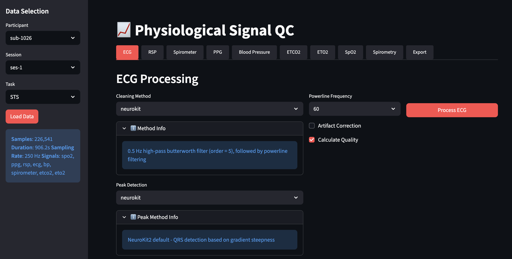
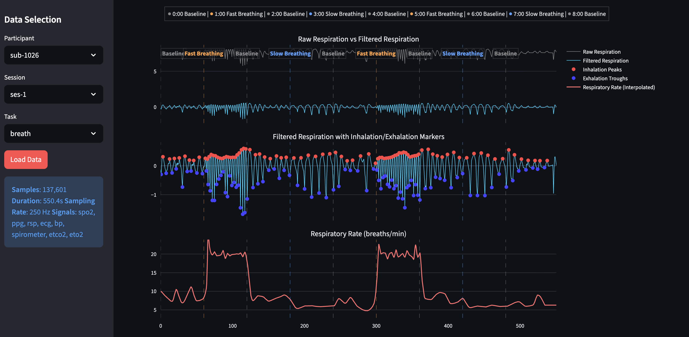
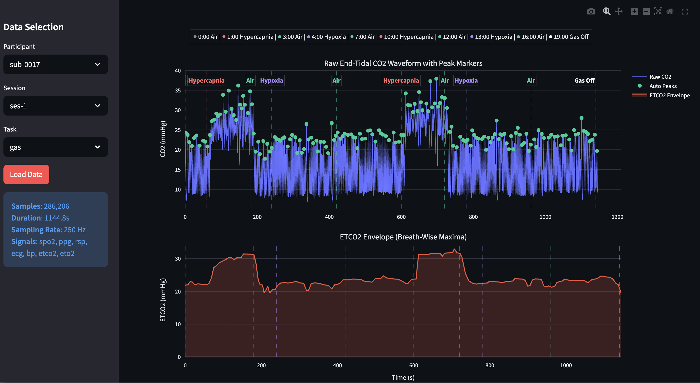

# Physio QC

Streamlit application for quality control of physiological recordings from Biopac `.acq` files.

## What the app does

1. Load one participant/session/task recording.
2. Process signal tabs (ECG, RSP, PPG, BP, ETCO2, ETO2, SpO2).
3. Review and manually edit detected peaks/troughs.
4. Export cleaned signals and metadata.

Session-B PMU enrichment is supported when scanner PMU files are available.

## Quick start

```bash
source .venv/bin/activate
streamlit run app.py
```

## Screenshots

### ECG processing menu



### RSP tab example (sub-1)



### Gas challenge timeline example (sub-00)



## Required input layout

Biopac recording:

```text
BASE_DATA_PATH/sub-XXXX/ses-YY/sub-XXXX_ses-YY_task-<task>_physio.acq
```

Optional PMU scanner files (session B):

```text
01_physio/sub-XXXX/ses-2/<ScannerFolder>/*.resp
01_physio/sub-XXXX/ses-2/<ScannerFolder>/*.puls
01_physio/sub-XXXX/ses-2/<ScannerFolder>/*.ext
```

`<ScannerFolder>` is one of the configured scanner directory variants in `utils/pmu_integration.py`.

BIDS scan timing table:

```text
PMU_BIDS_BASE_PATH/sub-XXXX/ses-02/sub-XXXX_ses-02_scans.tsv
```

## Configuration

Edit `config.py` for:

- data paths (`BASE_DATA_PATH`, `OUTPUT_BASE_PATH`, PMU paths),
- default processing parameters per signal,
- PMU matching behavior,
- task event overlays.

`.streamlit/config.toml` sets server defaults and file watcher mode.

## Repository layout

```text
app.py
config.py
algorithms/
metrics/
utils/
scripts/
  diagnostics/
  pmu/
docs/
media/
.streamlit/
```

Each folder has a local `README.md` with details.

## Operational scripts

PMU matching diagnosis (same matcher used by app PMU enrichment):

```bash
./scripts/diagnostics/diagnose_pmu_integration.py \
  --participant sub-1027 --session ses-2 --task rest
```

Standalone PMU scripts:

- `scripts/pmu/audit_pmu_availability.py`
- `scripts/pmu/visualize_pmu_recording.py`
- `scripts/pmu/extract_pmu_scan.py`

See `scripts/pmu/README.md` for usage.

## Development

See `docs/development-guide.md` for setup/check workflow.
Processing/protocol reference files are in `docs/bids_processing/`.

## License

MIT
